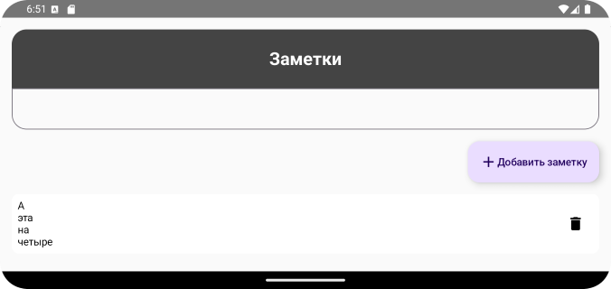

# Домашнее задание по теме "FloatingActionButton"

## Приложение «Заметки» 
На основе пройденного материала необходимо написать приложение для написания и просмотра заметок, с возможностью их удаления.

Приложение должно включать в себя:

- `Text`, отображающий заголовок приложения;
- `LazyColumn`, который будет отображать написанные пользователем заметки; 
- -`TextField`/`OutlinedTextField`, в который пользователь сможет вводить текст заметки;
- `FloatingActionButton`, при нажатии на которую, написанный пользователем текст в `TextField`/`OutlinedTextField` будет добавляться в список;
- `IconButton` напротив каждой заметки, при нажатии на которую, соответствующая заметка будет удаляться.

Рекомпозиция элементов экрана должнапроисходить моментально. При изменении ориентации экрана, состояние компонентов должно сохраняться. 

Конечный результат должен выглядеть примерно так:

## Скриншоты домашнего задания

